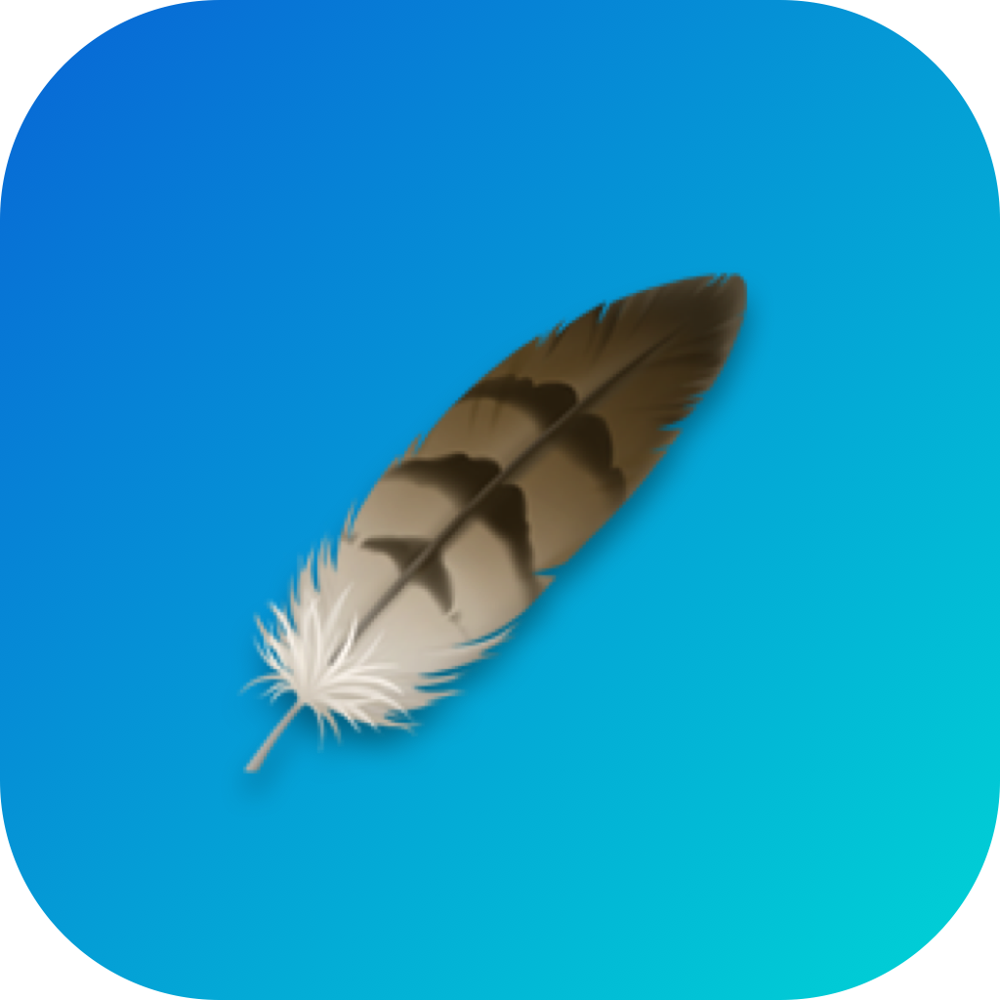

<p align="center">
  
</p>

<h1 align="center">FeatherShot</h1>

<p align="center">
  <em>Lightweight screenshot annotations — fast, native, and distraction-free.</em>
</p>

<p align="center">
  
  
  
</p>

<p align="center">
  
  
  
  
</p>

<p align="center">
  <a href="https://github.com/KurtStevenK/FeatherShot/releases/latest"><strong>📥 Download</strong></a>
  &nbsp;·&nbsp;
  <a href="https://kurtstevenk.github.io/FeatherShot/"><strong>🌐 Website</strong></a>
  &nbsp;·&nbsp;
  <a href="CHANGELOG.md"><strong>📋 Changelog</strong></a>
</p>

---

## ✨ What is FeatherShot?

FeatherShot is a **free, open-source** screenshot annotation tool. Capture a screen region, annotate it with arrows, numbered steps, and rectangles, then instantly save and copy — all in seconds.

No Dock icon. No bloat. No subscription.

> **New in v1.1.9:** Rock-solid **multi-monitor selection** with pointer capture. Improved **Magnifier** centering. Plus configurable zoom.

---

## 📥 Download

| Platform | Format | Requirements |
| --- | --- | --- |
| 🍎 **macOS** | [`.dmg` installer](https://github.com/KurtStevenK/FeatherShot/releases/latest) | macOS 14 (Sonoma) or later |
| 🪟 **Windows** | [`.exe` installer / portable](https://github.com/KurtStevenK/FeatherShot/releases/latest) | Windows 10 or later |
| 🐧 **Linux** | [`.deb` / `.AppImage`](https://github.com/KurtStevenK/FeatherShot/releases/latest) | Ubuntu 22.04+, Debian, Fedora |
| 🌐 **Chrome** | [Extension `.zip`](https://github.com/KurtStevenK/FeatherShot/releases/latest) | Chrome, Edge, Brave, Arc |

Or **build from source** — see [Build Instructions](#-build-from-source) below.

---

## 🛠 Annotation Tools

| Tool | Icon | Description |
| --- | --- | --- |
| **Step Arrow** ⭐ | `1→ 2→ 3→` | Arrows with **auto-incrementing numbered circles** at the start — perfect for step-by-step guides and tutorials. Default tool. |
| **Step Rectangle** | `1▢ 2▢ 3▢` | Rectangles with **auto-incrementing numbered circles** at the top-left corner — highlight multiple regions with ordered callouts. |
| **Arrow** | `↗` | Draw clean, directional arrows with elegant filled arrowheads. |
| **Rectangle** | `▢` | Highlight regions with outlined rectangles to draw attention to specific areas. |
| **Circle / Ellipse** | `◯` | Draw circles and ellipses by dragging a bounding box — stroke only, no fill. |
| **Line** | `╱` | Draw simple straight lines without arrowheads. |
| **Question Arrow** | `?→` | Arrow with a **Question Mark** circle at the start — perfect for marking unknown or questionable areas. |
| **Question Rectangle** | `?▢` | Rectangle with a **Question Mark** circle at the top-left corner. |
| **ABC Arrow** | `a→ b→ c→` | Arrows with **auto-incrementing lettered circles** (a, b, ..., z, aa, ab...) at the start. |
| **ABC Rectangle** | `a▢ b▢ c▢` | Rectangles with **auto-incrementing lettered circles** at the top-left corner. |
| **Magnifier** | `🔍` | Creates a circular zoom lens on the screenshot with **configurable zoom** (1.5×–5×). Click to set center, drag to set radius. |

### Additional Controls

- 🎨 **Color Picker** — Choose any annotation color via the native color wheel.
- 📏 **Line Width Slider** — Adjust stroke thickness from 2px to 15px.
- ↩️ **Undo / Clear** — Step back or wipe all annotations.
- 💾 **Save & Copy** — Saves a timestamped PNG to `~/Downloads` and copies to clipboard in one click.

---

## 🚀 Usage

### macOS

1. Click the **🪶** icon in your menu bar (or right-click for options).
2. Your cursor becomes a crosshair — **select a region** of your screen.
3. The **annotation editor** opens — pick a tool, draw, adjust color and width.
4. Click **Save & Copy** — done! Image is on your clipboard and in `~/Downloads`.

### Windows & Linux

1. FeatherShot appears as a **tray icon** in your system tray.
2. Left-click the icon (or right-click → Take Screenshot).
3. A **selection overlay** appears — **drag to select the area** you want to capture.
4. The **annotation editor** opens with your selected region.
5. Annotate and click **Save & Copy**.

> **Tip:** The selection overlay spans all connected monitors for multi-monitor support. Press **Esc** to cancel.

### Chrome Extension

1. Click the **FeatherShot** icon in your browser toolbar.
2. A **selection overlay** appears on the current tab — **drag to select an area**.
3. A new tab opens with the annotation editor showing only the selected region.
4. Annotate and click **Save & Download**.

---

## 🔨 Build from Source

<details>
<summary><strong>🍎 macOS (Native Swift App)</strong></summary>

Requires **Swift 6.0+** on macOS 14 (Sonoma) or later.

```bash
git clone https://github.com/KurtStevenK/FeatherShot.git
cd FeatherShot

# Build and run (debug)
swift build
.build/debug/FeatherShot &

# Build a release DMG
chmod +x build_release.sh
./build_release.sh
```

> **Note:** The `&` runs FeatherShot in the background so your terminal stays usable.

</details>

<details>
<summary><strong>🪟 Windows / 🐧 Linux (Electron)</strong></summary>

Requires **Node.js 20+**.

```bash
git clone https://github.com/KurtStevenK/FeatherShot.git
cd FeatherShot/electron-app

# Install dependencies
npm install

# Run in development mode
npm start

# Build installer
npm run build:win    # Windows .exe
npm run build:linux  # Linux .deb + .AppImage
```

</details>

<details>
<summary><strong>🌐 Chrome Extension</strong></summary>

1. Clone the repository.
2. Open `chrome://extensions` in your browser.
3. Enable **Developer mode** (top right).
4. Click **"Load unpacked"** and select the `chrome-extension/` directory.

</details>

---

## 🔐 Permissions

### macOS

| Permission | Why |
| --- | --- |
| **Screen Recording** | Required for `screencapture` to capture your screen. |
| **Accessibility** | May be requested depending on macOS security settings. |

Go to **System Settings → Privacy & Security** to manage these.

### Windows & Linux

No special permissions needed — FeatherShot uses Electron's `desktopCapturer` API.

### Chrome Extension

| Permission | Why |
| --- | --- |
| **Active Tab** | Captures the current tab as a screenshot. |
| **Downloads** | Saves annotated screenshots to your Downloads folder. |

---

## 🏗 Architecture

### macOS (Native)

A lean, 3-file Swift application:

```text
Sources/
├── AppMain.swift          # Menu bar app lifecycle, screen capture, window management
├── AnnotationView.swift   # SwiftUI editor with canvas, toolbar, save/export
└── DrawingShapes.swift    # Tool enum, shape definitions (Arrow, Line, Ellipse, Magnifier, Step variants, Question variants, ABC variants)
```

### Windows & Linux (Electron)

```text
electron-app/
├── main.js                # System tray, area selection, screen capture, window management
└── renderer/
    ├── index.html         # Editor UI
    ├── style.css          # Dark theme stylesheet
    ├── app.js             # Canvas-based annotation tools
    ├── selection.html     # Area selection overlay UI
    ├── selection.css      # Selection overlay styles
    └── selection.js       # Selection overlay logic
```

### Chrome Extension

```text
chrome-extension/
├── manifest.json          # Extension manifest v3
├── background.js          # Content script injection + tab capture
├── selector.js            # Area selection content script (injected into tab)
├── selector.css           # Selection overlay styles (injected into tab)
├── popup.html/js          # Toolbar popup UI
├── editor.html/css/js     # Full annotation editor with crop support
└── icons/                 # Extension icons
```

---

## 🤝 Contributing

Contributions are welcome! Here's how to get started:

1. **Fork** the repository.
2. **Create a branch** for your feature: `git checkout -b feature/my-feature`
3. **Commit** your changes: `git commit -m "Add my feature"`
4. **Push** and open a **Pull Request**.

### Adding a New Tool

See the workflow guide at [`.agents/workflows/add-tool.md`](.agents/workflows/add-tool.md) for a step-by-step walkthrough.

---

## 📋 Changelog

See [CHANGELOG.md](CHANGELOG.md) for a detailed release history.

---

## 📄 License

MIT License — see [LICENSE](LICENSE) for details.

Copyright © 2026 Kurt Steven Kainzmayer

---

<p align="center">
  <sub>Built with ❤️ · Crafted by <a href="https://github.com/KurtStevenK">Kurt Steven Kainzmayer</a></sub>
</p>
